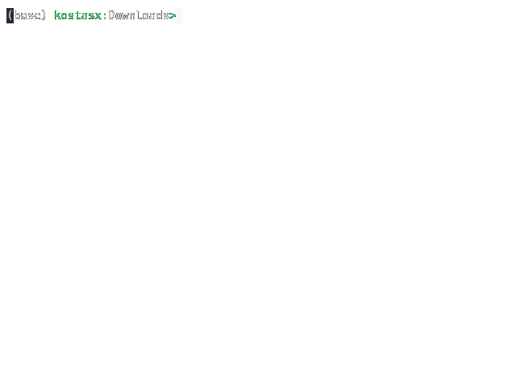

# FEATURES

## PLUGINS

### Mount and unmount selected disk drives (MacOS)

  Usage: 
  
  1. Configure drives: `atlas --mount set`
  2. Mount all selected drives: `atlas --mount on`
  3. Unmount all selected drives: `atlas --mount off`

  

### SRT to JSON conversion

  Usage:

  `atlas --srt2json documentary.srt > documentary.json`

  