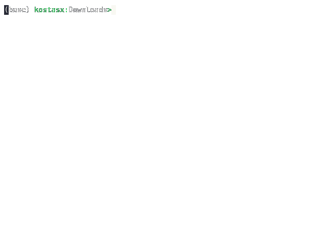

# FEATURES

## PLUGINS

  Type: `atlas -u` to see a list of available plugins.

### Scan QR Code from Image

  Usage:

  `atlas -u qrcode image_with_qrcode.png`;

### Manipulate Images

  Usage: `atlas -u img <filter> <image_filename>`

  `atlas -u img` => See available filters

  `atlas -u img sharpen cat.jpg` => Saves to `cat.sharpened.jpg`
  `atlas -u img scale=2 dog.png` => Saves to `dog.scaled.png`
  `atlas -u img upscale cat.jpg` => Saves to `cat.upscaled.jpg`
  `atlas -u img downscale cat.jpg` => Saves to `cat.downscaled.jpg`

### Get Public IP (What is my IP?)

  Usage:

  `atlas -u get_public_ip` or `atlas --use get_public_ip`

### Mount and unmount selected disk drives (MacOS)

  Usage: 
  
  1. Configure drives: `atlas --mount set`
  2. Mount all selected drives: `atlas --mount on`
  3. Unmount all selected drives: `atlas --mount off`

  

### SRT to JSON conversion

  Usage:

  `atlas --srt2json documentary.srt > documentary.json`

  or:

  `atlas -u srt2json documentary.srt > documentary.json`

  <!--  -->
